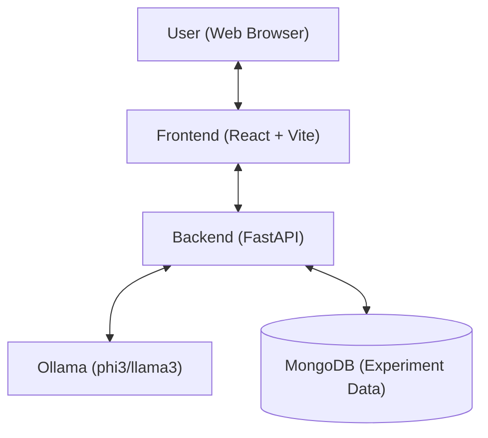
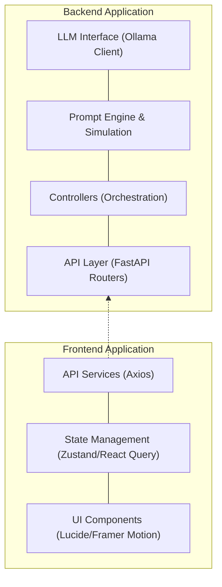
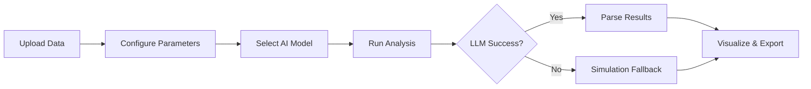
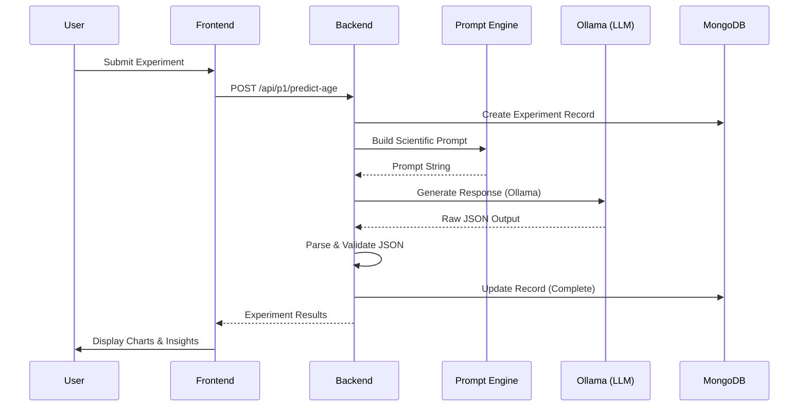

# WallahGPT — In-Silico Drug Discovery & Omics Platform

**WallahGPT** (formerly PreciousGPT) is a state-of-the-art computational biology platform designed for in-silico simulation of biological experiments. It leverages Large Language Models (LLMs) and advanced statistical simulation to provide researchers with a digital laboratory for biological aging analysis, synthetic data generation, and drug discovery.

The platform features a **ZeroKost Premium** design system, utilizing a futuristic dark theme, glassmorphic UI elements, and high-performance animations powered by `framer-motion`.

---

## 🏗️ High-Level Architecture

The platform follows a modern decoupled architecture with a React frontend, a FastAPI backend, and a local LLM inference engine.

---

## 📂 Layer Diagram

The system is organized into modular layers to ensure scalability and ease of integration with future real-world ML pipelines.

---

## 🔄 High-Level Workflow

The user journey is designed to be intuitive, guiding researchers from raw data upload to actionable biological insights.

---

## ⏱️ Request Sequence Diagram

This diagram illustrates the lifecycle of a single experiment request, showing how the backend orchestrates data processing and LLM interaction.

---

## 🧬 Core Modules

### 1. WallahGPT1: Biological Aging Clock
Predicts biological age from molecular data (DNA methylation, RNA-seq). 
- **Output**: Age acceleration score, SHAP gene importance, and disease risk classification.

### 2. WallahGPT2: Synthetic Omics Generator
Generates statistically valid synthetic multi-omics datasets.
- **Output**: Downloadable CSV/TSV matrices with preserved correlation structures.

### 3. WallahGPT3: Digital Drug Discovery
Simulates drug perturbation experiments in-silico.
- **Output**: Ranked drug candidates, predicted gene expression changes, and pathway enrichment.

---

## 🛠️ Technology Stack

| Component | Technology | Description |
|-----------|------------|-------------|
| **Frontend** | React, TypeScript, Vite | Modern, type-safe reactive UI. |
| **Styling** | TailwindCSS, ZeroKost Theme | Custom dark theme with glassmorphism and animations. |
| **Animations**| Framer Motion | Fluid, high-performance scroll and state transitions. |
| **State** | Zustand, React Query | Efficient global and server-side state management. |
| **Backend** | FastAPI (Python) | High-performance async API framework. |
| **Database** | MongoDB | NoSQL storage for experiments and projects. |
| **Inference** | Ollama | Local LLM runtime (Phi-3, Llama 3). |
| **Viz** | Recharts, Plotly | Scientific data visualization. |

---

## 🚀 Getting Started

### Prerequisites
- Python 3.10+
- Node.js 18+
- Ollama (running locally)

### Backend Setup
1. `cd PreciousGPT_Backend_Code`
2. `python -m venv venv`
3. `source venv/bin/activate` (or `venv\Scripts\activate` on Windows)
4. `pip install -r requirements.txt`
5. Copy `.env.example` to `.env` and fill in your credentials.
6. `uvicorn main:app --reload`

### Frontend Setup
1. `cd PreciousGPT_Frontend_Code`
2. `npm install`
3. Copy `.env.example` to `.env` (or use `.env.development`).
4. `npm run dev`

---

## 📜 Documentation
- [Backend Architecture](file:///c:/Users/DELL/Downloads/ZeroKost/PreciousGPT/PreciousGPT_Code/WallahGPT_Backend_Architecture.md)
- [Frontend Architecture](file:///c:/Users/DELL/Downloads/ZeroKost/PreciousGPT/PreciousGPT_Code/WallahGPT_Frontend_Architecture.md)
