# Large Language of Life Models (LLLMS) — Complete Architecture Diagrams Reference

**Document Version:** 1.0  
**Date:** March 2026  
**Project:** Large Language of Life Models (LLLMS) In-Silico Drug Discovery & Omics Platform  
**Author:** ZeroKost Engineering  
**Status:** Final

> This document contains all **12 derived and advanced architecture diagrams** for the Large Language of Life Models (LLLMS) platform, organized into two categories:
> - **Category 2 — Implicit / Hidden Diagrams** (Diagrams 7–12): Derived from the codebase structure and data flows.
> - **Category 3 — Advanced / Marketing Diagrams** (Diagrams 13–18): High-value platform positioning and reliability views.

---

## CATEGORY 2 — IMPLICIT / HIDDEN DIAGRAMS

---

## Diagram 7: AI Pipeline Diagram
### LLM + Parser + Fallback Flow

This diagram shows the complete AI inference pipeline inside every controller (`P1Controller`, `P2Controller`, `P3Controller`). It maps directly to the code in `controllers/p{1,2,3}_controller.py` and `llm/`.

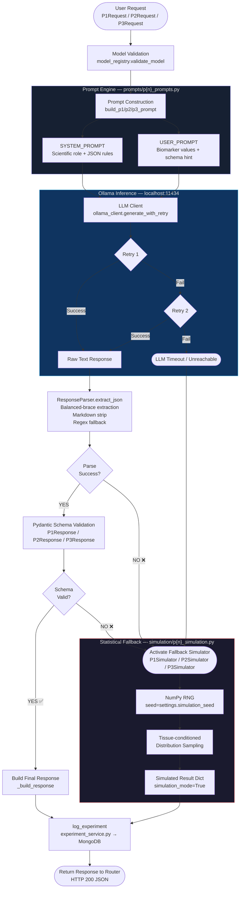

---

## Diagram 8: Module Architecture Diagram
### Large Language of Life Models (LLLMS) as a Three-Module System

Each module is fully independent — its own router, controller, prompt, schema, simulator, and frontend panel — yet shares common infrastructure.

```mermaid
graph TD
    subgraph PLATFORM ["🧬 Large Language of Life Models (LLLMS) Platform"]

        subgraph SHARED ["⚙️ Shared Infrastructure"]
            LLM_CLI[LLM Client\nollama_client.py]
            PARSER[Response Parser\nresponse_parser.py]
            MODEL_REG[Model Registry\nmodel_registry.py]
            EXP_SVC[Experiment Service\nexperiment_service.py]
            DB[(MongoDB)]
            AUTH_MOD[Auth Module\nauth_router + auth_service]
            PROJ_MOD[Project Module\nproject_router + project_service]
        end

        subgraph P1 ["🕰️ LifespanAI — Biological Aging Clock"]
            P1_ROUTER[p1_router.py\nPOST /api/p1/predict-age]
            P1_CTRL[p1_controller.py]
            P1_PROMPT[p1_prompts.py\nSYSTEM_PROMPT_P1\nbuild_p1_prompt]
            P1_SCHEMA[p1_schemas.py\nP1Request / P1Response]
            P1_SIM[p1_simulation.py\nP1Simulator]
            P1_FE["P1InputForm.tsx\nP1ExperimentPanel.tsx\nP1ResultsPanel.tsx"]
        end

        subgraph P2 ["🔬 Clinomics Engine — Synthetic Omics Generator"]
            P2_ROUTER[p2_router.py\nPOST /api/p2/generate-omics]
            P2_CTRL[p2_controller.py]
            P2_PROMPT[p2_prompts.py\nSYSTEM_PROMPT_P2\nbuild_p2_prompt]
            P2_SCHEMA[p2_schemas.py\nP2Request / P2Response]
            P2_SIM[p2_simulation.py\nP2Simulator]
            P2_FE["P2InputForm.tsx\nP2ExperimentPanel.tsx\nP2ResultsPanel.tsx"]
        end

        subgraph P3 ["💊 Multispecies & Tissue Engine — Digital Drug Discovery"]
            P3_ROUTER[p3_router.py\nPOST /api/p3/run-screen]
            P3_CTRL[p3_controller.py]
            P3_PROMPT[p3_prompts.py\nSYSTEM_PROMPT_P3\nbuild_p3_prompt]
            P3_SCHEMA[p3_schemas.py\nP3Request / P3Response]
            P3_SIM[p3_simulation.py\nP3Simulator]
            P3_FE["P3InputForm.tsx\nP3ExperimentPanel.tsx\nP3ResultsPanel.tsx"]
        end

    end

    P1_ROUTER --> P1_CTRL --> P1_PROMPT --> LLM_CLI
    P1_CTRL --> P1_SCHEMA
    P1_CTRL --> P1_SIM
    P1_CTRL --> EXP_SVC

    P2_ROUTER --> P2_CTRL --> P2_PROMPT --> LLM_CLI
    P2_CTRL --> P2_SCHEMA
    P2_CTRL --> P2_SIM
    P2_CTRL --> EXP_SVC

    P3_ROUTER --> P3_CTRL --> P3_PROMPT --> LLM_CLI
    P3_CTRL --> P3_SCHEMA
    P3_CTRL --> P3_SIM
    P3_CTRL --> EXP_SVC

    LLM_CLI --> PARSER
    LLM_CLI --> MODEL_REG
    EXP_SVC --> DB
    AUTH_MOD --> DB
    PROJ_MOD --> DB

    P1_FE -.->|"HTTP POST"| P1_ROUTER
    P2_FE -.->|"HTTP POST"| P2_ROUTER
    P3_FE -.->|"HTTP POST"| P3_ROUTER

    style P1 fill:#0d2137,stroke:#74b9ff
    style P2 fill:#0d2137,stroke:#00cec9
    style P3 fill:#0d2137,stroke:#a29bfe
    style SHARED fill:#1e1e2f,stroke:#636e72
```

---

## Diagram 9: LLM Interaction Diagram
### Prompt → Model → Output → Parser

A focused view of the single-turn LLM conversation structure used in every Large Language of Life Models (LLLMS) experiment.

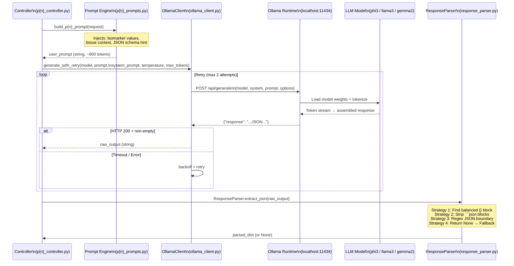

---

## Diagram 10: Experiment Lifecycle Diagram
### Create → Run → Process → Store → Retrieve → Visualize

The full state machine of a single Large Language of Life Models (LLLMS) experiment from user intent to visualized insight.

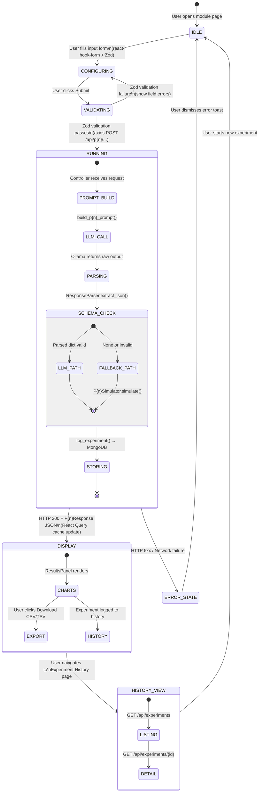

---

## Diagram 11: API Flow Diagram
### Frontend → Axios → FastAPI → Router → Controller

Shows the complete HTTP request journey from UI interaction through all backend middleware layers to the controller response.

```mermaid
flowchart LR
    subgraph FE ["🖥️ Frontend (React)"]
        FORM["Form Submit\n(handleSubmit)"]
        RQ["React Query\nuseMutation"]
        AX["Axios Instance\n(client.ts)"]
        INT["JWT Interceptor\nAuthorization: Bearer token"]
    end

    subgraph NETWORK ["🌐 HTTP Transport"]
        REQ["POST /api/p1/predict-age\nContent-Type: application/json\nAuthorization: Bearer eyJ..."]
    end

    subgraph FASTAPI ["⚙️ FastAPI Backend"]
        CORS["CORS Middleware\nOrigin check\nPreflight handling"]
        LOG_MW["Logging Middleware\npath + method + origin"]
        GW["FastAPI App\nRoute dispatch"]

        subgraph ROUTER ["P1 Router — api/p1_router.py"]
            AUTH_DEP["JWT Dependency\nOAuth2PasswordBearer\ndecode + validate token"]
            PYDANTIC["Pydantic Validation\nP1Request schema\nField type coercion"]
            HANDLER["Route Handler\nPOST /predict-age"]
        end

        subgraph CTRL ["P1 Controller — controllers/p1_controller.py"]
            MODEL_VAL["validate_model()"]
            PROMPT_B["build_p1_prompt()"]
            LLM_CALL["ollama_client.generate_with_retry()"]
            PARSE["ResponseParser.extract_json()"]
            FALLB["P1Simulator (if needed)"]
            LOG_EXP["log_experiment() → MongoDB"]
            RESPONSE["Return P1Response"]
        end
    end

    subgraph DB_LLM ["🔧 External Services"]
        OLLAMA_S["Ollama :11434"]
        MONGO_S["MongoDB :27017"]
    end

    FORM -->|trigger| RQ
    RQ --> AX
    AX --> INT
    INT --> REQ
    REQ --> CORS --> LOG_MW --> GW --> AUTH_DEP
    AUTH_DEP -->|token valid| PYDANTIC
    AUTH_DEP -->|invalid| ERR401(["HTTP 401 Unauthorized"])
    PYDANTIC -->|valid| HANDLER
    PYDANTIC -->|invalid| ERR422(["HTTP 422 Validation Error\n+ field details"])
    HANDLER --> MODEL_VAL --> PROMPT_B --> LLM_CALL
    LLM_CALL --> OLLAMA_S
    LLM_CALL --> PARSE
    PARSE -->|fail| FALLB
    FALLB --> LOG_EXP
    PARSE -->|success| LOG_EXP
    LOG_EXP --> MONGO_S
    LOG_EXP --> RESPONSE
    RESPONSE -->|HTTP 200 JSON| RQ
    RQ -->|cache result| FE
```

---

## Diagram 12: Data Flow Diagram (DFD)
### How Data Moves Across the Entire System

A level-1 DFD showing all data stores, data flows, and processes in the Large Language of Life Models (LLLMS) system.

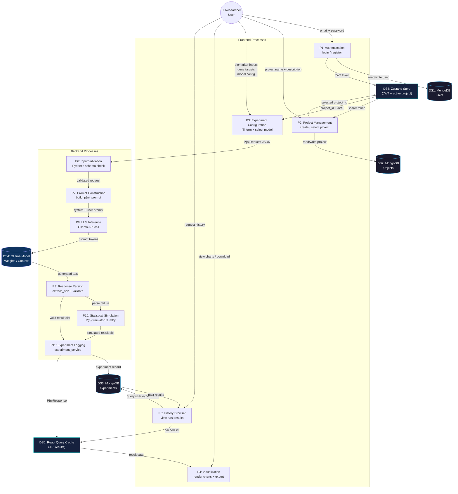

---
---

## CATEGORY 3 — ADVANCED / MARKETING DIAGRAMS

---

## Diagram 13: AI Operating System View
### Large Language of Life Models (LLLMS) as a Scientific AI Platform

This positions Large Language of Life Models (LLLMS) not as a single application, but as a **platform** — an AI Operating System for computational biology — with pluggable modules, a shared intelligence layer, and extensibility for future scientific domains.

```mermaid
graph TD
    subgraph PLATFORM_OS ["🚀 Large Language of Life Models (LLLMS) — AI Operating System for Computational Biology"]

        subgraph APPS ["📱 Application Layer — Pluggable Scientific Modules"]
            APP1["🕰️ LifespanAI\nBiological Aging Clock\n(Epigenomics / Transcriptomics)"]
            APP2["🔬 Clinomics Engine\nSynthetic Omics Generator\n(RNA-seq / Methylation / Proteomics)"]
            APP3["💊 Multispecies & Tissue Engine\nDigital Drug Discovery\n(CMAP-style Perturbation Screening)"]
            APP_FUTURE["🔭 Future Modules\nProtein Folding / Pathway Analysis\n/ Clinical Trial Simulation"]
        end

        subgraph INTELLIGENCE ["🧠 Intelligence Layer — Shared AI Engine"]
            PROMPT_OS["Scientific Prompt Engine\n(CRIST Framework)"]
            LLM_OS["Multi-Model LLM Router\n(phi3 / llama3 / gemma2 / mistral)"]
            PARSER_OS["Response Intelligence\n(JSON extraction + schema coercion)"]
            SIM_OS["Statistical Fallback Engine\n(NumPy / SciPy simulation)"]
        end

        subgraph PLATFORM_SVC ["🔧 Platform Services — Core Infrastructure"]
            AUTH_OS["Identity & Access\n(JWT Auth + User Isolation)"]
            PROJ_OS["Research Workspace\n(Projects + Experiment Organization)"]
            LOG_OS["Experiment Ledger\n(Full audit trail in MongoDB)"]
            EXPORT_OS["Data Export Service\n(CSV / TSV / JSON)"]
        end

        subgraph DATA_OS ["🗄️ Data Platform"]
            MONGO_OS["MongoDB\n(Experiments + Users + Projects)"]
            OLLAMA_OS["Ollama Runtime\n(Local GPU/CPU Inference)"]
        end

        subgraph UX_OS ["🎨 Researcher Experience Layer"]
            UI_OS["ZeroKost Design System\n(Glassmorphic Dark Mode UI)"]
            VIZ_OS["Scientific Visualization\n(Recharts + Plotly)"]
            MODEL_SEL["Model Selection Control\n(Per-experiment LLM config)"]
        end

    end

    APPS --> INTELLIGENCE
    INTELLIGENCE --> PLATFORM_SVC
    PLATFORM_SVC --> DATA_OS
    UX_OS --> APPS

    style APPS fill:#0d1b2a,stroke:#74b9ff,color:#ffffff
    style INTELLIGENCE fill:#1a0030,stroke:#a29bfe,color:#ffffff
    style PLATFORM_SVC fill:#001a1a,stroke:#00cec9,color:#ffffff
    style DATA_OS fill:#1a1000,stroke:#fdcb6e,color:#ffffff
    style UX_OS fill:#1a0020,stroke:#fd79a8,color:#ffffff
```

---

## Diagram 14: Scientific Workflow Diagram
### From Raw Biological Question to Actionable Insight

This shows the researcher's journey through the platform and the scientific transformation at each stage.

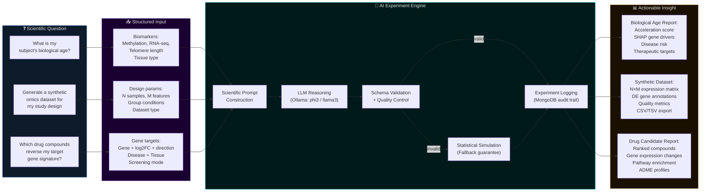

---

## Diagram 15: Reliability Architecture Diagram
### The Fallback System — Always-On Guarantee

Large Language of Life Models (LLLMS) is designed to **never return an error to the researcher**. This diagram shows the three-layer reliability architecture.

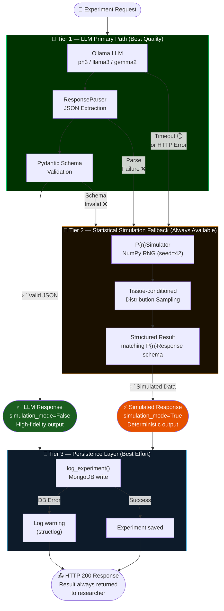

---

## Diagram 16: Multi-Model Strategy Diagram
### Model Selection Layer — LLM Choice Architecture

Large Language of Life Models (LLLMS) exposes a **per-experiment model selection layer** via the `ModelSelectorWidget` frontend component and the `model_registry` backend, enabling researchers to trade off speed vs. scientific fidelity.

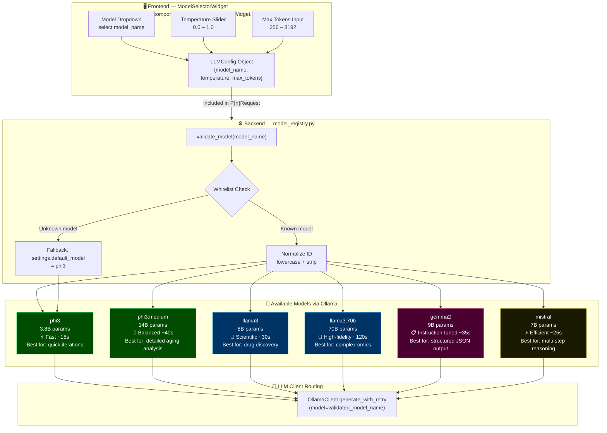

---

## Diagram 17: Performance Flow Diagram
### LLM vs. Simulation Latency — Time-to-Result

Shows the wall-clock time breakdown for each path through the system, helping researchers understand response time expectations.

```mermaid
gantt
    title Large Language of Life Models (LLLMS) — Request Latency Breakdown (milliseconds)
    dateFormat  X
    axisFormat  %s ms

    section LLM Path — phi3 (3.8B) — Fast Mode
    Frontend Validation (Zod)         :done,    fe1, 0, 50
    HTTP Transport + CORS             :done,    net1, 50, 100
    Pydantic Schema Validation        :done,    pyd1, 100, 150
    build_p{n}_prompt()               :done,    pr1, 150, 200
    Ollama generate (phi3)            :active,  llm1, 200, 18000
    ResponseParser.extract_json()     :done,    rp1, 18000, 18100
    Pydantic Output Validation        :done,    pv1, 18100, 18150
    log_experiment() MongoDB write    :done,    db1, 18150, 18300
    HTTP Response + React Query cache :done,    re1, 18300, 18500

    section LLM Path — llama3 (8B) — Balanced Mode
    Frontend Validation (Zod)         :done,    fe2, 0, 50
    HTTP Transport + CORS             :done,    net2, 50, 100
    Pydantic Schema Validation        :done,    pyd2, 100, 150
    build_p{n}_prompt()               :done,    pr2, 150, 200
    Ollama generate (llama3)          :active,  llm2, 200, 45000
    ResponseParser.extract_json()     :done,    rp2, 45000, 45100
    Pydantic Output Validation        :done,    pv2, 45100, 45150
    log_experiment() MongoDB write    :done,    db2, 45150, 45300
    HTTP Response + React Query cache :done,    re2, 45300, 45500

    section Simulation Fallback Path — Always < 1s
    Frontend Validation (Zod)         :done,    fe3, 0, 50
    HTTP Transport + CORS             :done,    net3, 50, 100
    Pydantic Schema Validation        :done,    pyd3, 100, 150
    LLM Timeout / Failure detected    :crit,    fail, 150, 300
    P{n}Simulator.simulate() NumPy    :done,    sim3, 300, 600
    log_experiment() MongoDB write    :done,    db3, 600, 750
    HTTP Response + React Query cache :done,    re3, 750, 900
```

### Latency Summary Table

| Path | Model | Typical P50 | Typical P95 | Notes |
|------|-------|------------|------------|-------|
| LLM — phi3 | 3.8B | 15–20s | 35s | Default; good for fast iteration |
| LLM — phi3:medium | 14B | 35–50s | 80s | Higher reasoning quality |
| LLM — llama3 | 8B | 25–45s | 70s | Best scientific accuracy balance |
| LLM — llama3:70b | 70B | 90–120s | 180s | Highest fidelity (needs GPU) |
| LLM — gemma2 | 9B | 30–40s | 65s | Best JSON formatting compliance |
| LLM — mistral | 7B | 20–35s | 55s | Fast + strong multi-step reasoning |
| **Simulation Fallback** | — | **< 500ms** | **< 1s** | Always available, deterministic |

---

## Diagram 18: Security Architecture Diagram
### JWT, Validation, Isolation — Defence in Depth

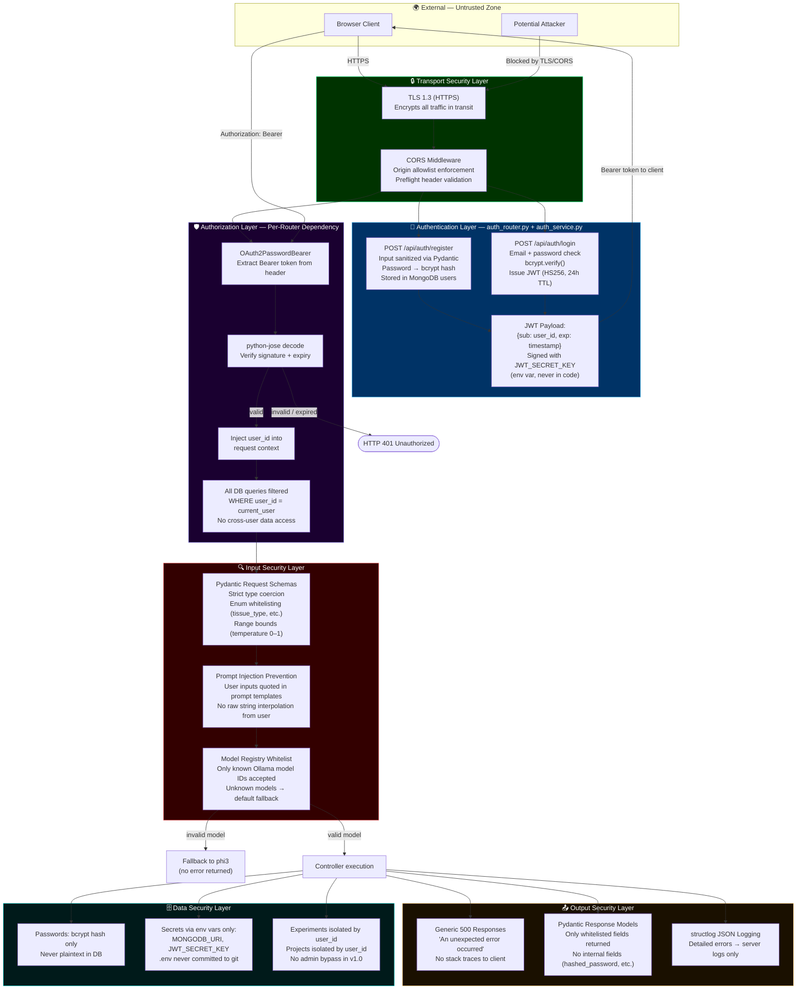

---

## Quick Reference: All 18 Diagrams

| # | Diagram | Location | Category |
|---|---------|----------|----------|
| 1 | High-Level Architecture | Technical Architecture Doc | Core |
| 2 | Layer Architecture | Technical Architecture Doc | Core |
| 3 | Request Sequence (P1) | Technical Architecture Doc | Core |
| 4 | Database ERD | Technical Architecture Doc | Core |
| 5 | Frontend Component Tree | Technical Architecture Doc | Core |
| 6 | Local Deployment Topology | Technical Architecture Doc | Core |
| **7** | **AI Pipeline (LLM + Parser + Fallback)** | **This Document** | Implicit |
| **8** | **Module Architecture (P1/P2/P3 + shared infra)** | **This Document** | Implicit |
| **9** | **LLM Interaction (Prompt → Model → Parser)** | **This Document** | Implicit |
| **10** | **Experiment Lifecycle State Machine** | **This Document** | Implicit |
| **11** | **API Flow (FE → Axios → FastAPI → Controller)** | **This Document** | Implicit |
| **12** | **Data Flow Diagram (DFD Level-1)** | **This Document** | Implicit |
| **13** | **AI Operating System Platform View** | **This Document** | Marketing |
| **14** | **Scientific Workflow (Question → Insight)** | **This Document** | Marketing |
| **15** | **Reliability Architecture (3-Tier Fallback)** | **This Document** | Marketing |
| **16** | **Multi-Model Strategy (LLM Selection Layer)** | **This Document** | Marketing |
| **17** | **Performance Flow (LLM vs. Simulation Latency)** | **This Document** | Marketing |
| **18** | **Security Architecture (JWT + Isolation + Validation)** | **This Document** | Marketing |

---

*End of Large Language of Life Models (LLLMS) Architecture Diagrams — v1.0*
