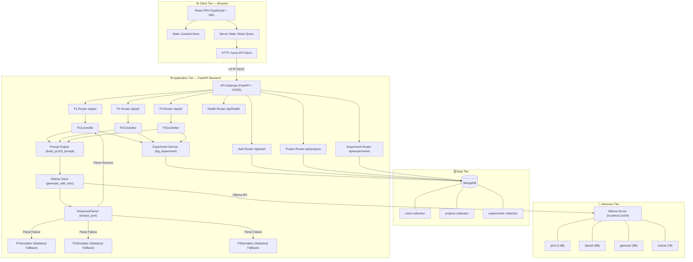
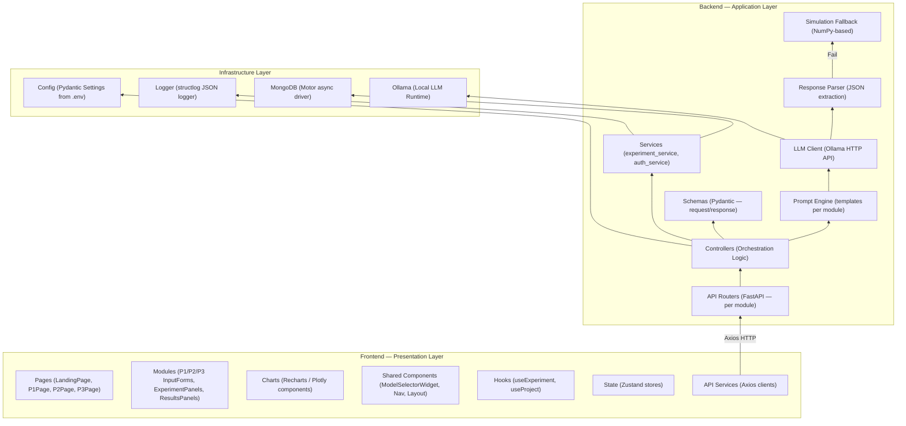
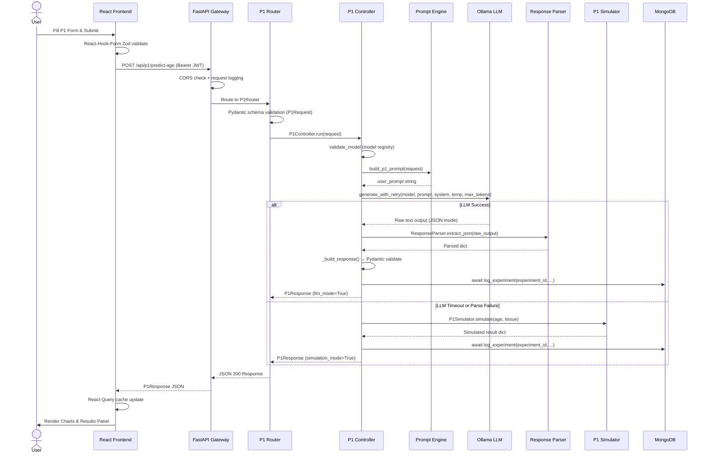
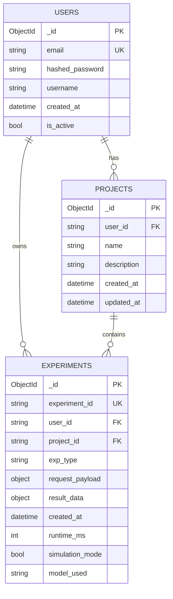
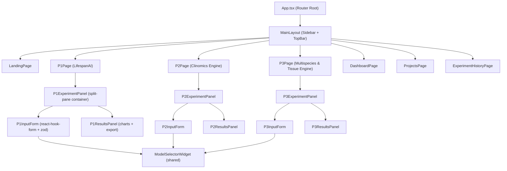
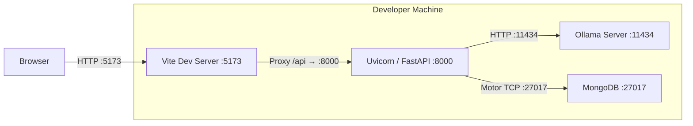
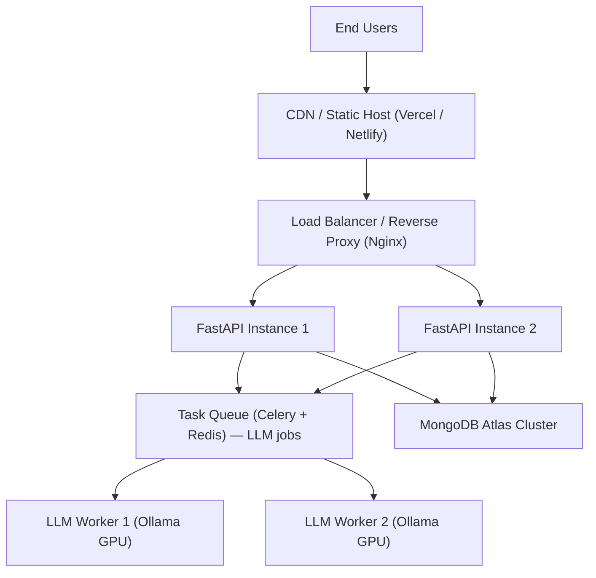

# Large Language of Life Models (LLLMS) — Technical Architecture Document

**Document Version:** 1.0  
**Date:** March 2026  
**Project:** Large Language of Life Models (LLLMS) In-Silico Drug Discovery & Omics Platform  
**Author:** ZeroKost Engineering — Systems Architecture  
**Status:** Approved

---

## 1. System Overview

Large Language of Life Models (LLLMS) is a full-stack, AI-powered computational biology platform built on a **decoupled microservice-style architecture**. It comprises:

- A **React + TypeScript SPA** (frontend) — bundled with Vite for development.
- A **FastAPI (Python) asynchronous REST API** (backend) — handles all business logic and LLM orchestration.
- A **MongoDB** NoSQL database — stores users, projects, and experiment records.
- An **Ollama** local inference server — runs open-source LLMs (Phi-3, Llama 3, etc.) locally.

The three core AI modules (LifespanAI, Clinomics Engine, Multispecies & Tissue Engine) are independently routed but share the same LLM client infrastructure, prompt engine, simulation fallback layer, and experiment logging service.

---

## 2. High-Level Architecture Diagram



---

## 3. Layer Architecture Diagram



---

## 4. Request Sequence Diagram

### 4.1 LifespanAI — Full Experiment Flow



---

## 5. Database Schema Design

### 5.1 Collections Overview



### 5.2 Experiment Document Example (P1)

```json
{
  "_id": "ObjectId(...)",
  "experiment_id": "e4a2b1c3-...-uuid4",
  "user_id": "user_abc123",
  "project_id": "proj-1",
  "exp_type": "p1",
  "request_payload": {
    "experiment_name": "Brain Aging Study 01",
    "chronological_age": 55.0,
    "tissue_type": "Brain",
    "methylation_level": 0.72,
    "llm_config": { "model_name": "phi3", "temperature": 0.3 }
  },
  "result_data": {
    "predicted_biological_age": 62.4,
    "age_acceleration_score": 7.4,
    "age_acceleration_class": "accelerated",
    "shap_genes": [{"gene": "FOXO3", "importance": 0.87, "direction": "down"}],
    "simulation_mode": false,
    "runtime_ms": 18420
  },
  "created_at": "2026-03-24T10:30:00Z"
}
```

---

## 6. API Endpoint Map

### 6.1 Authentication

| Method | Endpoint | Auth | Description |
|--------|----------|------|-------------|
| POST | `/api/auth/register` | No | Register new user |
| POST | `/api/auth/login` | No | Login, receive JWT |
| GET | `/api/auth/me` | JWT | Get current user info |

### 6.2 Projects

| Method | Endpoint | Auth | Description |
|--------|----------|------|-------------|
| POST | `/api/projects` | JWT | Create project |
| GET | `/api/projects` | JWT | List all user projects |
| GET | `/api/projects/{id}` | JWT | Get single project |
| DELETE | `/api/projects/{id}` | JWT | Delete project |

### 6.3 Experiments

| Method | Endpoint | Auth | Description |
|--------|----------|------|-------------|
| GET | `/api/experiments` | JWT | List all user experiments |
| GET | `/api/experiments/{id}` | JWT | Get experiment by ID |

### 6.4 LifespanAI (Biological Aging)

| Method | Endpoint | Auth | Description |
|--------|----------|------|-------------|
| POST | `/api/p1/predict-age` | JWT | Run biological age prediction |
| GET | `/api/p1/experiments` | JWT | List P1 experiment history |
| GET | `/api/p1/experiments/{id}` | JWT | Get P1 experiment result |

### 6.5 Clinomics Engine (Synthetic Omics)

| Method | Endpoint | Auth | Description |
|--------|----------|------|-------------|
| POST | `/api/p2/generate-omics` | JWT | Generate synthetic omics dataset |
| GET | `/api/p2/experiments` | JWT | List P2 experiment history |
| GET | `/api/p2/experiments/{id}` | JWT | Get P2 experiment result |
| GET | `/api/p2/download/{id}` | JWT | Download full matrix as CSV/TSV |

### 6.6 Multispecies & Tissue Engine (Drug Discovery)

| Method | Endpoint | Auth | Description |
|--------|----------|------|-------------|
| POST | `/api/p3/run-screen` | JWT | Run in-silico drug screen |
| GET | `/api/p3/experiments` | JWT | List P3 experiment history |
| GET | `/api/p3/experiments/{id}` | JWT | Get P3 experiment result |

### 6.7 System

| Method | Endpoint | Auth | Description |
|--------|----------|------|-------------|
| GET | `/api/health` | No | Health check + Ollama status |

---

## 7. Frontend Architecture

### 7.1 Application Component Tree



### 7.2 State Management Architecture

| Store | Technology | Responsibility |
|-------|-----------|---------------|
| `authStore` | Zustand | JWT token, current user, login/logout |
| `projectStore` | Zustand | Active project selection |
| `experimentStore` | Zustand | Current experiment status (running / idle) |
| Server Data Cache | React Query | All API responses — P1/P2/P3 results, project list, history |

### 7.3 API Client Structure (`src/api/`)

| File | Description |
|------|-------------|
| `client.ts` | Axios instance with base URL, JWT interceptor, error handling |
| `p1Api.ts` | `runP1Experiment()`, `getP1Experiment()`, `listP1Experiments()` |
| `p2Api.ts` | `runP2Experiment()`, `downloadOmicsDataset()` |
| `p3Api.ts` | `runP3Experiment()`, `getP3Experiment()` |
| `authApi.ts` | `login()`, `register()`, `getMe()` |
| `projectApi.ts` | `createProject()`, `listProjects()`, `deleteProject()` |

---

## 8. Backend Internal Architecture

### 8.1 Backend Module Map

```
PreciousGPT_Backend_Code/
├── main.py                    # FastAPI app, router registration, middleware, lifespan
├── config.py                  # Pydantic Settings (env vars: MONGO_URI, OLLAMA_URL, etc.)
├── database.py                # Motor async MongoDB connection (connect/close)
│
├── api/                       # FastAPI Routers (HTTP layer only)
│   ├── auth_router.py
│   ├── project_router.py
│   ├── experiment_router.py
│   ├── p1_router.py
│   ├── p2_router.py
│   ├── p3_router.py
│   └── health_router.py
│
├── controllers/               # Business logic orchestration
│   ├── p1_controller.py       # P1: validate → prompt → LLM → parse → fallback → log
│   ├── p2_controller.py       # P2: validate → prompt → LLM → parse → fallback → log
│   └── p3_controller.py       # P3: validate → prompt → LLM → parse → fallback → log
│
├── prompts/                   # Prompt templates (SYSTEM + USER per module)
│   ├── p1_prompts.py
│   ├── p2_prompts.py
│   └── p3_prompts.py
│
├── llm/                       # LLM abstraction layer
│   ├── client_factory.py      # Returns OllamaClient instance
│   ├── ollama_client.py       # HTTP calls to Ollama API with retry
│   ├── response_parser.py     # JSON extraction from raw LLM text
│   └── model_registry.py     # Whitelisted model validation
│
├── simulation/                # Deterministic statistical fallback engines
│   ├── p1_simulation.py
│   ├── p2_simulation.py
│   └── p3_simulation.py
│
├── schemas/                   # Pydantic request/response models
│   ├── p1_schemas.py
│   ├── p2_schemas.py
│   ├── p3_schemas.py
│   └── common_schemas.py
│
├── services/                  # Database interaction services
│   ├── experiment_service.py  # log_experiment(), get_experiment(), list_experiments()
│   ├── auth_service.py        # register_user(), authenticate_user(), create_token()
│   └── project_service.py     # CRUD for projects
│
└── utils/
    └── logger.py              # structlog JSON structured logger
```

### 8.2 Configuration & Environment Variables

| Variable | Required | Default | Description |
|----------|----------|---------|-------------|
| `MONGODB_URI` | Yes | — | MongoDB connection string |
| `OLLAMA_BASE_URL` | Yes | `http://localhost:11434` | Ollama server URL |
| `DEFAULT_MODEL` | No | `phi3` | Default LLM model |
| `JWT_SECRET_KEY` | Yes | — | Secret for JWT signing |
| `JWT_ALGORITHM` | No | `HS256` | JWT algorithm |
| `SIMULATION_SEED` | No | `42` | NumPy RNG seed for fallback |
| `ALLOWED_ORIGINS` | No | `*` | CORS origins |
| `LOG_LEVEL` | No | `INFO` | Logging verbosity |

---

## 9. Deployment Architecture

### 9.1 Local Development Topology



### 9.2 Production-Ready (Future) Topology



---

## 10. Security Architecture

| Layer | Control | Implementation |
|-------|---------|---------------|
| Transport | HTTPS | TLS termination at reverse proxy |
| Authentication | JWT Bearer | `HS256` signed tokens, 24h expiry |
| Authorization | User isolation | `user_id` filter on all DB queries |
| Password Storage | bcrypt | `passlib[bcrypt]` with auto-salting |
| Input Validation | Pydantic | Strict schema validation on all request bodies |
| CORS | Configurable | `ALLOWED_ORIGINS` env var |
| LLM Injection | Prompt sanitization | User inputs quoted/escaped in prompt templates |
| Error Leakage | Generic 500 responses | Detailed errors only in server logs |
| API Secrets | Environment variables | Never committed to source code |

---

## 11. Performance Characteristics

| Metric | Target | Notes |
|--------|--------|-------|
| LLM inference (phi3, 3.8B) | 15–40 seconds | Depends on hardware |
| LLM inference (llama3, 8B) | 30–90 seconds | Higher quality, slower |
| Statistical fallback | < 500ms | Pure Python NumPy |
| MongoDB query latency | < 50ms | Indexed on user_id, project_id |
| Frontend initial load | < 2s | Vite code splitting + lazy routes |
| API validation error | < 10ms | Pydantic synchronous validation |

---

## 12. Technology Stack Summary

| Component | Technology | Version | Purpose |
|-----------|-----------|---------|---------|
| Frontend Framework | React | 18.x | Component-based UI |
| Language (FE) | TypeScript | 5.x | Type safety |
| Build Tool | Vite | 5.x | Fast HMR dev server |
| Styling | TailwindCSS | 3.x | Utility-first CSS |
| Animation | Framer Motion | 11.x | Scientific UI transitions |
| State | Zustand | 4.x | Global client state |
| Server State | React Query (TanStack) | 5.x | API caching & sync |
| Forms | React Hook Form + Zod | 7.x / 3.x | Validated form handling |
| Charts | Recharts + Plotly.js | latest | Scientific visualization |
| HTTP Client | Axios | 1.x | JWT-intercepted API calls |
| Backend Framework | FastAPI | 0.110+ | Async REST API |
| Language (BE) | Python | 3.10+ | Type-hinted backend logic |
| DB Driver | Motor (async PyMongo) | 3.x | Non-blocking MongoDB |
| Database | MongoDB | 7.x | Document store |
| LLM Runtime | Ollama | latest | Local open-source LLM |
| Data Validation (BE) | Pydantic v2 | 2.x | Schema enforcement |
| Logging | structlog | latest | Structured JSON logs |
| Password Hashing | passlib[bcrypt] | latest | Secure auth |
| Auth Tokens | python-jose | latest | JWT creation/validation |

---

*End of Technical Architecture Document — Large Language of Life Models (LLLMS) v1.0*
